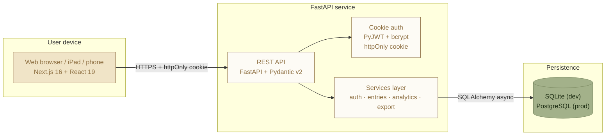
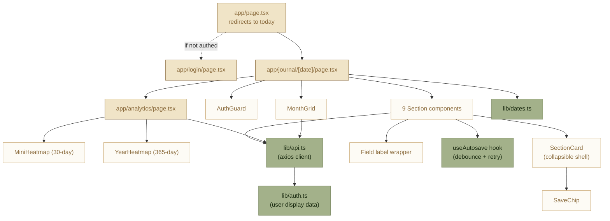
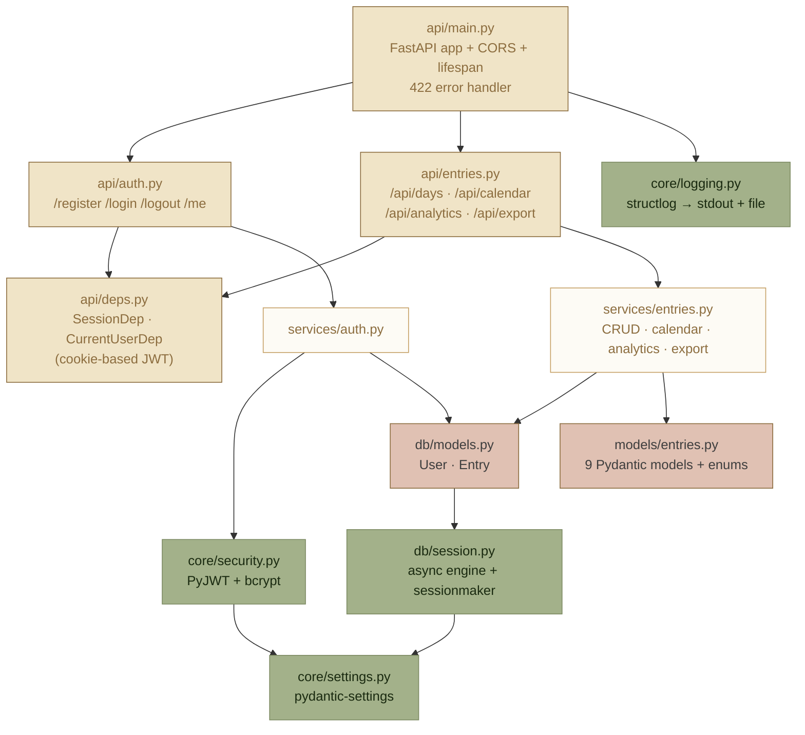
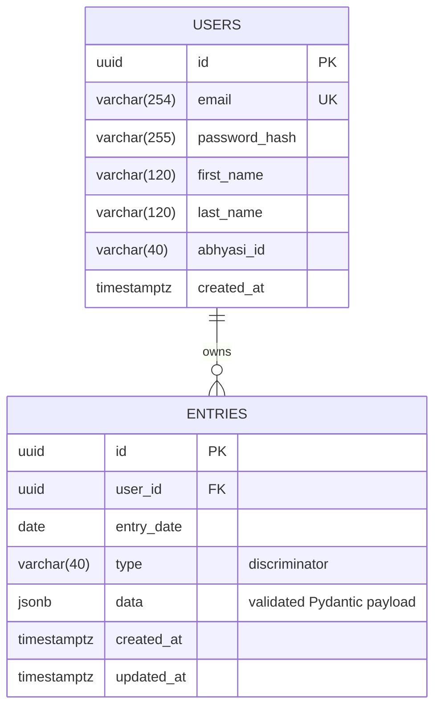
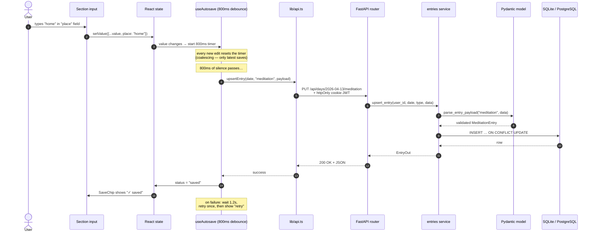

<div align="center">

# My Diary — Fullstack Journaling App

Spiritual practice + wellness journaling with a beautiful Next.js frontend and a high-performance FastAPI backend.

## ⚡ Quick Start (Local Development)

Start the entire stack — Backend API and Frontend UI — with a single command from the project root:

```bash
npm run dev    # OR: make dev
```

> [!NOTE]
> Uses SQLite locally. No Docker required. The backend auto-creates tables and the frontend proxies API calls — just clone and run.

[](https://www.python.org/)
[](https://fastapi.tiangolo.com/)
[](https://nextjs.org/)
[](https://react.dev/)
[](https://www.typescriptlang.org/)
[](https://www.postgresql.org/)
[](#license)

</div>

---

## Table of contents

- [What it is](#what-it-is)
- [Why it exists](#why-it-exists)
- [Screens & flows](#screens--flows)
- [Feature overview](#feature-overview)
- [Architecture](#architecture)
- [Data model](#data-model)
- [Request lifecycle — the autosave story](#request-lifecycle--the-autosave-story)
- [Design system](#design-system)
- [Project layout](#project-layout)
- [Getting started](#getting-started)
- [Configuration](#configuration)
- [API reference](#api-reference)
- [Testing](#testing)
- [Deployment — GCP](#deployment--gcp)
- [Pushing to GitHub](#pushing-to-github)
- [Roadmap](#roadmap)
- [Credits & lineage](#credits--lineage)
- [License](#license)

---

## What it is

**My Diary** is a full-stack web application for logging eight categories of daily activity in a single, quiet page per day:

| Group | Entry types |
|---|---|
| **Practice** | Morning meditation · Cleaning · Sitting · Group meditation |
| **Body** | Sleep · Gym · Activity (running, swimming, cycling, badminton, …) |
| **Reflection** | Free-form journal · Personal Watch (daily behaviour checkboxes) |

Open it and you land on today's page. Tap a section to expand it, log what happened, and keep typing — everything autosaves as you go. A monthly calendar on the right colours each day by how much you've logged. An **Analytics dashboard** reveals your practice patterns over months and a full year at a glance.

Works on desktop web, iPad Safari, and phone browsers (installable as a PWA).

---

## Why it exists

Three motivations, all of which shaped the design:

1. **One place, one page, one habit.** Having meditation logs in one app, sleep in a wearable, and journal entries in Notes means none of them get kept up. A single page per day, with thin placeholders for everything, lowers the activation energy of logging.

2. **Calm, not clinical.** Most habit-trackers and fitness apps look like dashboards. This one looks like a diary — warm paper, serif type, gold accents — because daily reflection is a quieter activity than "closing your rings."

3. **Shared schema with [My-Tele-PA](https://github.com/vaibhavd030/My-Tele-PA).** The domain models mirror that project's `wellness.py` exactly, so an entry written here can be read there and vice versa. Design language is inherited from [Heart_speaks](https://github.com/vaibhavd030/Heart_speaks).

---

## Screens & flows

### Daily journal (desktop / iPad)

A two-column layout: **eight section cards** on the left, grouped into *Practice*, *Body*, and *Reflection*, with a sticky **month calendar** on the right. Each section is collapsed by default and shows a one-line summary when filled (`06:30 · 30 min · home`). Tap the whole row to expand; autosave fires 800ms after the last keystroke.

Header icons (top-right): **Search** · **Dark/Light theme toggle** · **Calendar** (mobile) · **Analytics** · **Export JSON** · **Sign out**.

### Daily journal (phone)

Same layout, but the calendar moves into a **bottom-sheet drawer** invoked by the calendar icon in the header, and the sections stack single-column. No feature is mobile-only.

### Analytics dashboard

Accessible from the journal header. Two view modes:

- **Month view** — three themed columns: Practice (Meditation, Cleaning, Sitting), Wellbeing (Sleep, Gym, Activity), Habits (6 Personal Watch checkboxes). Each stat shows a value, unit, secondary metric, and a **30-day mini-heatmap**.
- **Year view** — an interactive **365-day heatmap grid** per practice category. Click any day cell to teleport directly to that date's journal entry.

### Login / registration

Single card, tabbed between *Sign in* and *Create account*. Optional Heartfulness `abhyasi_id` field for registration. Auth is handled via a server-set **httpOnly cookie** — the JWT never touches JavaScript.

---

## Feature overview

### ✍️ Daily logging

- **9 entry types**, each with its own validated Pydantic schema
- **Autosave** with 800ms debounce and one retry on failure
- **Collapsible cards** — empty sections stay tucked away; filled ones show a summary
- **Skeleton placeholders** during navigation (no layout flash)
- **Focus refresh** — data revalidates when the browser tab regains focus

### 📅 Calendar view

- Monday-first month grid with richness colouring:

  | Richness | Meaning | Fill |
  |---|---|---|
  | 0 | Empty day | paper |
  | 1 | One entry type | faint gold `#F0E4C7` |
  | 2–3 | A few | vibrant gold `#D4AF37` |
  | 4–5 | Most | bronze `#8C6D3F` |
  | 6+ | Full day | bronze with sage-green ring |

- Today marked with a dashed outline; selected day with solid outline
- Future days disabled
- Hover tooltip shows logged types
- "This month" panel counts totals per type

### 📊 Analytics dashboard

- **Month view**: Per-category stats with 30-day mini-heatmaps
- **Year view**: 365-day interactive heatmap — click any day to navigate
- Annual summary stats: total hours, consistency score
- Smooth loading skeletons and error recovery

### 🧘 Meditation tracking (enhanced)

- **Time · Duration · Place** — the basics
- **Quality rating (1–10 stars)** — same star system as Sleep
- **4 awareness checkboxes**:
  - Distracted
  - Deep & unaware
  - Deep & transmission
  - Calm, Deep at the End
- **How it felt** — freeform textarea
- All fields auto-saved

### 📤 Data export

- **One-click JSON export** — downloads `my_diary_export_YYYY-MM-DD.json`
- Contains every logged day, grouped by date, with all entry payloads
- Available from both the Journal and Analytics page headers
- Endpoint: `GET /api/export`

### 🛡️ Security

- **httpOnly cookie auth** — JWT is set by the backend, never readable by JavaScript
- PyJWT with HS256 (configurable), bcrypt password hashing
- CORS origin allowlist (not wildcard)
- Future-date guard on all write operations
- Server-side date normalization prevents cross-date spoofing

### 📱 PWA

- Installable on iOS, Android, and desktop
- Manifest pre-configured with paper-coloured theme
- Service-worker-ready architecture

---

## Architecture

### High-level overview



### Frontend module graph



### Backend module graph



### Database schema



**Uniqueness:** `(user_id, entry_date, type)` — one entry per day per type.  
**Indexes:** `users.email` (unique), `entries.user_id`, `entries.entry_date`.  
**Migrations:** managed by Alembic. Run `alembic upgrade head` before first start.

---

## Data model

The `entries.data` JSONB column is a discriminated union — `type` tells the application which Pydantic model to validate against on write. New fields can be added to the Pydantic model without an Alembic migration (the JSON blob absorbs them).

### Entry payload reference

| `type` | Required | Optional payload fields |
|---|---|---|
| `meditation` | `date` | `datetime_logged`, `duration_minutes` (1–300), `place`, `felt`, **`quality`** (1–10), **`is_distracted`**, **`is_deep_unaware`**, **`is_deep_transmission`**, **`is_calm_deep_end`**, `notes` |
| `cleaning` | `date` | `datetime_logged`, `duration_minutes` (1–300), `notes` |
| `sitting` | `date` | `datetime_logged`, `duration_minutes` (1–300), `took_from`, `notes` |
| `group_meditation` | `date` | `datetime_logged`, `duration_minutes` (1–300), `place`, `notes` |
| `sleep` | `date` | `bedtime`, `wake_time`, `duration_hours` (auto-derived), `quality` (1–10), `notes` |
| `gym` | `date` | `datetime_logged`, `duration_minutes` (1–600), `body_parts[]`, `intensity` (1–10), `notes` |
| `activity` | `date` | `datetime_logged`, `activity_type`, `duration_minutes`, `distance_km`, `intensity` (1–10), `notes` |
| `journal_note` | `date`, `body` | — |
| `personal_watch` | `date` | `got_angry`, `mtb`, `scrolled_phone`, `junk_food`, `watched_movie`, `slept_late` (all bool) |

> Fields in **bold** were added in April 2026 to the meditation schema.

### Enums

```python
class MuscleGroup(StrEnum):           # for GymEntry.body_parts (multi-select)
    FULL_BODY   UPPER_BODY   LOWER_BODY
    CHEST       BACK         SHOULDERS
    BICEPS      TRICEPS      ABS   STRETCHING

class ActivityType(StrEnum):          # for ActivityEntry.activity_type
    RUN   WALK   SWIM   CYCLE
    BADMINTON   TENNIS   PICKLEBALL
    YOGA   OTHER
```

### Auto-derivation rules

- **Sleep duration** — if both `bedtime` and `wake_time` are given, `duration_hours` is auto-computed. If `wake_time ≤ bedtime`, bedtime is treated as the previous calendar day (23:00 → 07:00 = 8h).
- **Server-side date normalization** — the `date` field in any payload is overwritten by the URL path parameter; clients cannot spoof cross-date writes.
- **Future-date guard** — the API rejects `PUT` for dates strictly after today.

---

## Request lifecycle — the autosave story

The single most important UX behaviour is autosave. Here's how a keystroke in the meditation section becomes a persisted row:



### Why this design

- **Debounce** prevents the server from being spammed mid-word.
- **Coalescing** ensures only the final state is persisted — intermediate keystrokes never reach the DB.
- **Single retry** handles transient network blips without surfacing an error immediately.
- **Server-side UPSERT** on the `(user_id, entry_date, type)` unique constraint makes saves idempotent — you cannot accidentally create duplicates.
- **httpOnly cookie** — the JWT is never accessible to `document.cookie`; no XSS attack can steal the session.

---

## Design system

Inherited wholesale from [Heart_speaks](https://github.com/vaibhavd030/Heart_speaks) so both apps feel like they belong in the same ecosystem.

### Palette

| Token | Hex | Role |
|---|---|---|
| `paper` | `#F5F1E6` | Page background |
| `paper-soft` | `#FDFBF5` | Textarea / inset surfaces |
| `ink` | `#3E3E3E` | Primary text |
| `ink-soft` | `#735E3B` | Secondary text |
| `gold-accent` | `#C5A065` | Borders, small emphasis |
| `gold-vibrant` | `#D4AF37` | Medium-richness calendar fill, stars |
| `gold-faint` | `#F0E4C7` | Low-richness fill, button hover |
| `bronze` | `#8C6D3F` | Headings, high-richness fills |
| `sage-green` | `#A3B18A` | Full-day ring, "saved" chip |
| `border-cream` | `#E6DECE` | Default card border |

### Typography

- **Pinyon Script** — the "My Diary" wordmark (logo only)
- **Playfair Display** — page date & section titles
- **Crimson Text** — journal textarea (the writing surface)
- **Geist Sans** — all UI chrome (buttons, labels, inputs)

### Motifs

- 10% opacity diagonal SVG pattern overlay on every page (paper texture)
- White cards with a 2px gold gradient top-strip
- Italic serif subtitles on section cards
- Pill chips for multi-select (body parts)
- Star ratings (10 stars) for sleep and meditation quality
- 2×2 checkbox grid for meditation awareness states

---

## Project layout

```
my_diary/
│
├── backend/
│   ├── src/my_diary/
│   │   ├── api/                    # FastAPI routers & dependencies
│   │   │   ├── main.py             ← app, CORS, lifespan, 422 handler
│   │   │   ├── deps.py             ← SessionDep, CurrentUserDep (cookie JWT)
│   │   │   ├── auth.py             ← /register /login /logout /me
│   │   │   └── entries.py          ← /api/days /api/calendar /api/analytics /api/export
│   │   ├── core/                   # framework-agnostic plumbing
│   │   │   ├── settings.py         ← pydantic-settings (DATABASE_URL, JWT_SECRET, …)
│   │   │   ├── logging.py          ← structlog config (console + file)
│   │   │   └── security.py         ← PyJWT + bcrypt helpers
│   │   ├── db/                     # persistence
│   │   │   ├── models.py           ← SQLAlchemy ORM: User, Entry
│   │   │   └── session.py          ← async engine + sessionmaker
│   │   ├── models/                 # domain Pydantic models
│   │   │   └── entries.py          ← 9 entry types + enums (MuscleGroup, ActivityType)
│   │   ├── schemas/                # HTTP request/response shapes
│   │   │   ├── api.py              ← DayOut, EntryOut, CalendarMonthOut, …
│   │   │   └── analytics.py        ← MonthlyStat, AnalyticsMonthOut
│   │   └── services/               # business logic, testable in isolation
│   │       ├── auth.py             ← register, authenticate, get_user
│   │       └── entries.py          ← UPSERT, calendar, analytics, export
│   ├── alembic/                    # DB migrations
│   │   ├── env.py                  ← async-ready, reads settings.database_url
│   │   └── versions/
│   │       └── 1552cc48a454_initial_schema.py  ← baseline (users + entries + indexes)
│   ├── tests/
│   │   ├── conftest.py             ← in-memory SQLite fixtures
│   │   └── test_smoke.py           ← register → login → 9 entries → calendar → export
│   ├── alembic.ini                 ← script_location = backend/alembic
│   ├── pyproject.toml
│   └── .env.example
│
├── frontend/
│   ├── src/
│   │   ├── app/
│   │   │   ├── layout.tsx          ← global fonts + metadata
│   │   │   ├── globals.css         ← design tokens + utility classes + dark mode
│   │   │   ├── page.tsx            ← redirect: authed → today, else login
│   │   │   ├── login/page.tsx
│   │   │   ├── journal/[date]/page.tsx
│   │   │   └── analytics/page.tsx  ← Month + Year view dashboard
│   │   ├── components/
│   │   │   ├── AuthGuard.tsx
│   │   │   ├── analytics/
│   │   │   │   ├── MiniHeatmap.tsx   ← 30-day heatmap for monthly stats
│   │   │   │   └── YearHeatmap.tsx   ← 365-day interactive year grid
│   │   │   ├── calendar/
│   │   │   │   └── MonthGrid.tsx
│   │   │   ├── sections/
│   │   │   │   ├── SectionCard.tsx         ← shared collapsible shell
│   │   │   │   ├── MeditationSection.tsx   ← time · duration · quality stars · 4 checkboxes
│   │   │   │   ├── CleaningSection.tsx
│   │   │   │   ├── SittingSection.tsx
│   │   │   │   ├── GroupMeditationSection.tsx
│   │   │   │   ├── SleepSection.tsx        ← bedtime/wake + stars + auto-duration
│   │   │   │   ├── GymSection.tsx          ← body-part pills + intensity stars
│   │   │   │   ├── ActivitySection.tsx
│   │   │   │   ├── JournalSection.tsx
│   │   │   │   └── PersonalWatchSection.tsx ← 6 daily behaviour checkboxes
│   │   │   └── ui/
│   │   │       ├── Field.tsx               ← labeled form wrapper
│   │   │       └── SaveChip.tsx            ← idle / saving / saved / retry
│   │   └── lib/
│   │       ├── api.ts              ← typed axios client (all API calls + exportDiary())
│   │       ├── auth.ts             ← user display data from localStorage (no JWT in JS)
│   │       ├── dates.ts            ← ISO date utils, timezone-safe
│   │       └── useAutosave.ts      ← 800ms debounce + retry hook
│   ├── public/
│   │   └── manifest.json           ← PWA manifest
│   ├── package.json
│   ├── tsconfig.json
│   ├── next.config.ts              ← API proxy rewrites to backend
│   └── .env.local.example
│
├── Dockerfile                      ← multi-stage: Next.js build + Python runtime
├── docker-compose.yml              ← Postgres for container-based local dev
├── env.prod.example                ← production secrets template
├── Makefile                        ← dev / lint / test shortcuts
├── notes2.md                       ← project evaluation & architecture notes
├── updates2.md                     ← roadmap & GCP deployment guide
├── README.md
└── .gitignore
```

---

## Getting started

### Prerequisites

| Tool | Version | Why |
|---|---|---|
| Python | ≥ 3.12 | Pydantic v2, StrEnum, asyncio improvements |
| Node.js | ≥ 20 | Next.js 16 requirement |
| `uv` | any | Fast Python package manager (recommended) |
| Docker | any | Only needed if using `docker-compose` for Postgres |

### 1. Clone

```bash
git clone https://github.com/vaibhavd030/My_Diary.git
cd My_Diary
```

### 2. Backend

```bash
cd backend
uv sync                              # or: pip install -e ".[dev]"
cp .env.example .env                 # edit: set JWT_SECRET to a random 32+ char string
# Tables are auto-created in dev mode. For production, use Alembic:
# uv run alembic upgrade head
uv run uvicorn my_diary.api.main:app --reload --host 0.0.0.0
```

API live at `http://localhost:8000`. Interactive docs at `/docs`.

### 3. Frontend

```bash
cd frontend
cp .env.local.example .env.local     # already points at http://localhost:8000
npm install
npm run dev
```

Open `http://localhost:3000`. Create an account, land on today's journal.

### 4. One-command (recommended)

From the project root:

```bash
npm install          # installs concurrently
npm run dev          # starts both backend and frontend
```

---

## Configuration

All backend configuration is loaded from environment variables (or a `.env` file in `backend/`) via `pydantic-settings`.

| Variable | Required | Default | Purpose |
|---|:---:|---|---|
| `DATABASE_URL` | ✓ | — | Async SQLAlchemy URL. SQLite for dev: `sqlite+aiosqlite:///./diary.db` |
| `JWT_SECRET` | ✓ | — | Cookie signing key (≥ 32 chars). Generate: `openssl rand -hex 32` |
| `JWT_ALGORITHM` | | `HS256` | `HS256`, `HS384`, or `HS512` |
| `ACCESS_TOKEN_EXPIRE_MINUTES` | | `10080` (1 week) | Session lifetime |
| `TIMEZONE` | | `Europe/London` | Server-side date calculations |
| `LOG_LEVEL` | | `INFO` | `DEBUG`, `INFO`, `WARNING`, `ERROR` |
| `LOG_FORMAT` | | `console` | `console` (dev) or `json` (Cloud Run) |
| `CORS_ORIGINS` | | `["http://localhost:3000"]` | JSON list of allowed origins |
| `ENVIRONMENT` | | `development` | Set to `production` in GCP |

Frontend (`frontend/.env.local`):

| Variable | Default | Purpose |
|---|---|---|
| `NEXT_PUBLIC_API_BASE_URL` | `http://localhost:8000` | Backend URL |

---

## API reference

All endpoints except `/auth/register`, `/auth/login`, and `/healthz` require authentication via the session cookie (set automatically by the browser after login). Full OpenAPI schema is at `http://localhost:8000/docs`.

### Auth

| Method | Path | Auth | Purpose |
|---|---|:---:|---|
| POST | `/auth/register` | — | Create account (email + password ≥ 8 chars) |
| POST | `/auth/login` | — | Exchange credentials for session cookie (httpOnly) |
| POST | `/auth/logout` | ✓ | Clear the session cookie |
| GET | `/auth/me` | ✓ | Current user's public profile |

### Entries

| Method | Path | Auth | Purpose |
|---|---|:---:|---|
| GET | `/api/days/{entry_date}` | ✓ | All entries for one day, keyed by type |
| PUT | `/api/days/{entry_date}/{entry_type}` | ✓ | Create or replace one entry (idempotent) |
| DELETE | `/api/days/{entry_date}/{entry_type}` | ✓ | Delete one entry |
| GET | `/api/calendar/{year}/{month}` | ✓ | Monthly summary (richness per day) |

### Analytics

| Method | Path | Auth | Purpose |
|---|---|:---:|---|
| GET | `/api/analytics/{year}/{month}` | ✓ | Monthly stats + 30-day heatmaps per category |
| GET | `/api/analytics/{year}/annual` | ✓ | Annual stats + 365-day heatmap data per category |

> [!IMPORTANT]
> The `/annual` endpoint is registered **before** `/{month}` in the router. This is intentional — FastAPI matches routes in declaration order, and the string `"annual"` must not be parsed as an integer month. Do not reorder these routes.

### Export & Search

| Method | Path | Auth | Purpose |
|---|---|:---:|---|
| GET | `/api/export` | ✓ | Download all entries as `my_diary_export_YYYY-MM-DD.json` |
| GET | `/api/search?query=` | ✓ | Full-text search across all entry payloads |

### Example: upsert a meditation session

```bash
curl -X PUT http://localhost:8000/api/days/2026-04-13/meditation \
  -b "access_token=$TOKEN" \
  -H "Content-Type: application/json" \
  -d '{
    "data": {
      "duration_minutes": 30,
      "place": "home",
      "quality": 8,
      "is_distracted": false,
      "is_deep_unaware": true,
      "is_deep_transmission": false,
      "is_calm_deep_end": true,
      "felt": "Very calm and centred"
    }
  }'
```

### Example: export all diary entries

```bash
curl -b "access_token=$TOKEN" http://localhost:8000/api/export \
  -o my_diary_export.json
```

Response shape:
```json
{
  "exported_at": "2026-04-13",
  "total_days": 42,
  "total_entries": 187,
  "days": [
    {
      "date": "2026-04-13",
      "entries": {
        "meditation": { "duration_minutes": 30, "quality": 8, "is_calm_deep_end": true, "..." : "..." },
        "sleep": { "bedtime": "22:30:00", "duration_hours": 7.5, "quality": 7 }
      }
    }
  ]
}
```

### System

| Method | Path | Auth | Purpose |
|---|---|:---:|---|
| GET | `/healthz` | — | Liveness probe |

---

## Testing

```bash
cd backend
uv run pytest -q
```

The smoke test at `tests/test_smoke.py`:

1. Registers a user, logs in.
2. Upserts one entry of **every** type (all 9, including `personal_watch`).
3. Verifies sleep `duration_hours` was auto-computed from bedtime + wake_time.
4. Fetches the calendar summary and asserts `richness == 9` for today.
5. Attempts to write tomorrow's journal — expects HTTP 400.
6. Runs the export endpoint and checks the response structure.

Tests use an **in-memory SQLite** database via `aiosqlite`, so no Postgres is needed. The JSON column falls back to SQLite's `JSON` type via SQLAlchemy `with_variant`.

---

## Deployment — GCP

The app is designed to deploy to **Google Cloud Run** with **Cloud SQL (PostgreSQL)** as the database. See [`updates2.md`](./updates2.md) for the complete step-by-step GCP setup guide.

### Target architecture

```
Internet → Cloud Armor → Cloud Load Balancer → Cloud Run (frontend + backend)
                                                         ↓ private VPC
                                                  Cloud SQL (PostgreSQL 15)
                                                         ↓
                                             Secrets: Secret Manager
                                             Logs:    Cloud Logging
```

### Quick deploy steps

```bash
# 1. Build and push image
docker build -t europe-west1-docker.pkg.dev/PROJECT/my-diary/app:latest .
docker push europe-west1-docker.pkg.dev/PROJECT/my-diary/app:latest

# 2. Run migrations (on new deploy)
alembic upgrade head

# 3. Deploy backend to Cloud Run
gcloud run deploy my-diary-backend \
  --image=europe-west1-docker.pkg.dev/PROJECT/my-diary/app:latest \
  --region=europe-west1 \
  --set-secrets=JWT_SECRET=jwt-secret:latest,DATABASE_URL=database-url:latest \
  --set-env-vars="ENVIRONMENT=production,LOG_FORMAT=json"

# 4. Deploy frontend
gcloud run deploy my-diary-frontend \
  --image=europe-west1-docker.pkg.dev/PROJECT/my-diary/app:latest \
  --region=europe-west1 \
  --allow-unauthenticated
```

### Production environment variables

Set these in **Secret Manager** (never in source code):

- `DATABASE_URL` — `postgresql+asyncpg://user:pass@/dbname?host=/cloudsql/PROJECT:REGION:INSTANCE`
- `JWT_SECRET` — generate with `openssl rand -hex 32`
- Set `CORS_ORIGINS` to your frontend Cloud Run URL
- Set `LOG_FORMAT=json` for structured Cloud Logging ingestion

### Migrations

Run `alembic upgrade head` before every deployment that changes the database schema. For Cloud Run, use a **Cloud Run Job** or a pre-deploy step in your CI/CD pipeline.

```bash
# From project root
PYTHONPATH=backend/src backend/.venv/bin/alembic -c backend/alembic.ini upgrade head
```

> [!IMPORTANT]
> Adding new fields to Pydantic entry models (like the meditation checkboxes) **does not require an Alembic migration** — the JSON blob column absorbs them automatically. Only structural changes to the `users` or `entries` SQL tables need migrations.

---

## Pushing to GitHub

```bash
# Create an empty repo at https://github.com/new — name it My_Diary.
# Leave "Initialize this repository with a README" unchecked.

git remote add origin git@github.com:vaibhavd030/My_Diary.git
git push -u origin main
```

---

## Roadmap

| # | Feature | Status |
|---|---|---|
| ✅ | Monthly analytics dashboard with heatmaps | Done |
| ✅ | Annual 365-day heatmap with day teleport | Done |
| ✅ | Meditation quality stars + awareness checkboxes | Done |
| ✅ | One-click JSON export | Done |
| ✅ | httpOnly cookie auth (no JWT in JavaScript) | Done |
| ✅ | Alembic migrations + production Dockerfile | Done |
| 🔲 | Rate limiting on auth endpoints | Next |
| 🔲 | Settings page (change password, delete account) | Next |
| 🔲 | PWA icons (manifest has no icons — install broken) | Next |
| 🔲 | CI/CD with Cloud Build | Planned |
| 🔲 | PDF / Markdown export | Planned |
| 🔲 | Real offline support (service worker + IndexedDB) | Future |
| 🔲 | Streak badges and long-term trend charts | Future |
| 🔲 | Import from My-Tele-PA / BigQuery | Future |

---

## Credits & lineage

- **Design language** — inherited from [Heart_speaks (SAGE)](https://github.com/vaibhavd030/Heart_speaks), a spiritual-archive retrieval platform. The paper/gold/bronze/sage palette, serif typography stack, and card motif all come from there so both apps feel like siblings.
- **Domain models** — mirror [My-Tele-PA](https://github.com/vaibhavd030/My-Tele-PA)'s `life_os.models.wellness` module. `MeditationEntry`, `CleaningEntry`, `SittingEntry`, `GroupMeditationEntry`, `SleepEntry`, and the `MuscleGroup` / `ActivityType` enums are taken directly. An entry written via Telegram to My-Tele-PA and an entry written here are schema-compatible.
- **Icons** — [Lucide](https://lucide.dev/).
- **Fonts** — Google Fonts (Pinyon Script, Playfair Display, Crimson Text, Geist, Geist Mono).

Built for personal use, with care.

---

## License

MIT. See [`LICENSE`](LICENSE) if present, or copy the standard MIT text.

---

<div align="center">

*Built with care for a quiet kind of discipline.*

</div>